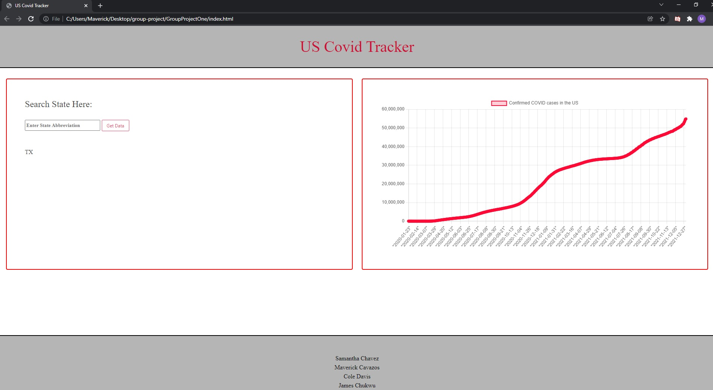

#Group-Project

SEARCH BAR API: https://apidocs.covidactnow.org/#current-data-for-all-states-counties-or-metros

GRAPH API: https://covid19.richdataservices.com/rds/api/query/us/covidtracking_state/select?where=(us_state_postal=NY%20OR%20us_state_postal=CA%20OR%20us_state_postal=TX)%20AND%20(date_stamp=2020-06-17)&cols=us_state_postal,cnt_tested_pos,cnt_tested&metadata=true

CSS Framework: BULMA

This application will show covid data and rates around the globe using two apis that show real time data, death rate, and recovery rate. 

Below is a image of the home page which is the index.html! This page displays both of our API's used which include the search state bar on the left and the real time graph on the right.

The search state bar uses a API that provides real time covid data on a state by state basis. The information we chose to target and display were the cases, death rate, and vaccinations given.
Once you search a state it is then stored in local data and displayed below to show which state you have previously looked up.

On the right hand side you can see the graph. This uses a API that shows the confirmed covid cases in the US. As the API is updated with new data so is the graph. This graph will be as current as the previous day! 

As for the design we choose to keep it simple when discussing such sensitive medical data on a more somber, but useful, topic. 

